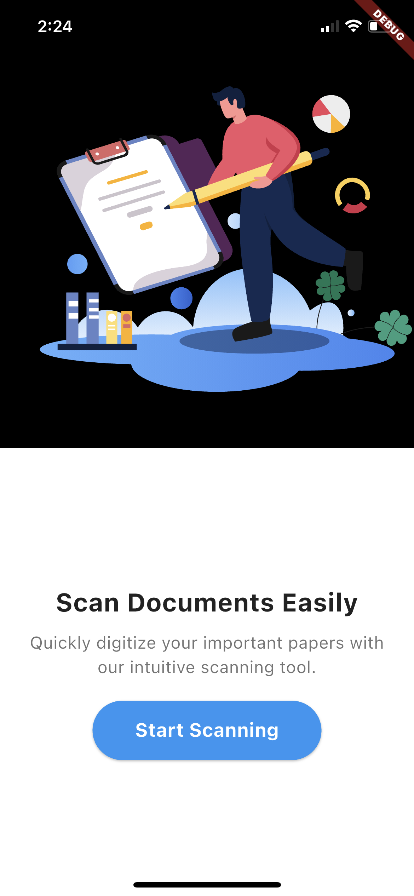
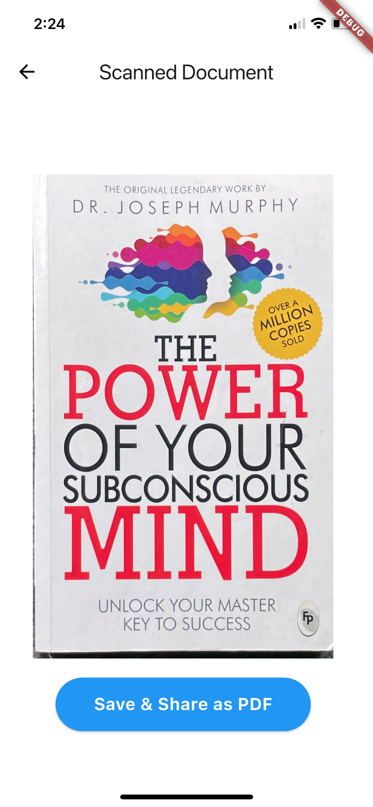
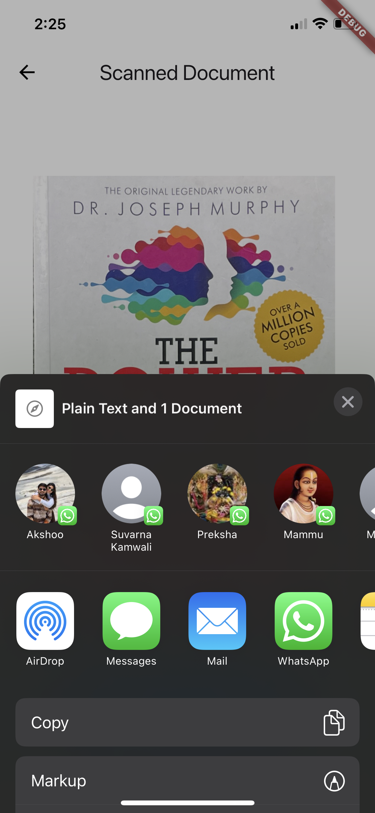

# documentscanner

I developed a minimalistic iOS document scanning app focused on delivering a clean and intuitive user experience. The app allows users to scan physical documents using their device camera and perform essential image adjustments before exporting the final result as a PDF.

**Key Features Implemented:**

**Document Scanning**__: 
Integrated camera functionality to capture high-resolution images of documents.

**Image Editing Tools:**__

Cropping: Users can manually adjust the document boundaries.
Rotation: Simple controls to rotate images for proper alignment.
Enhancement: Applied filters to improve clarity and contrast for better readability.
PDF Export: Users can compile scanned pages into a single PDF file for easy sharing or storage.

**Design & UX:**

Focused on a minimalist, high-end design that aligns with modern iOS aesthetics.
Ensured smooth transitions, intuitive gestures, and a clutter-free interface.
Prioritized usability and visual clarity throughout the app.

## App Preview

| Home Screen | Scanned Document | Share Sheet |
|:-----------:|:----------------:|:-----------:|
|  |  |  |

### Demo Video

https://github.com/Mansi4481/Ease-scan/assets/app-vd1.mov

